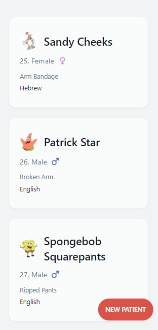
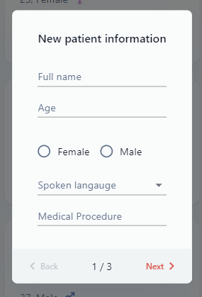

# Gist MD Patient Management System

## Background

This project was created as a part of a take-home project.

### Features

- Responsive mobile-first layout
- Form validation
- User-editable patient avatars

### Usage

Clicking the 'NEW PATIENT' button will allow you to add a new patient.  

Click anywhere outside the modal to close it.  
After submitting the new patient form, you'll be able to see the new patient on the list
